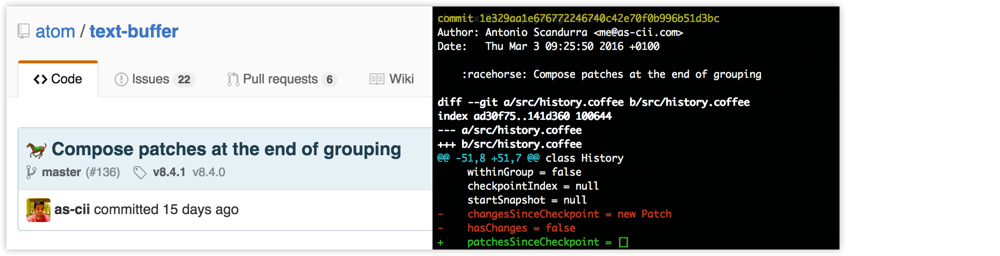

You have open before you an unavoidably arrogant avalanche of bikeshedding which
serves as an explanation of my personal coding style. While I don't envision any
of my projects ever becoming a conduit for collaboration (since I prefer working
alone), I'll at least have something in black-and-white to direct anybody to who
feels compelled to send a PR on one of my projects.

**~~Table~~**
**TL;DR of contents:**

1.  [Use tabs for indentation](#1-use-tabs-for-indentation)
2.  [Don't use tabs for alignment](#2-dont-use-tabs-for-alignment)
3.  [K&R bracing style](#3-bracing-style)
4.  [Casing style](#4-casing-style)
5.  [Use semicolons](#5-semicolons)
6.  [Comma-last](#6-comma-last)
7.  [Writing commit messages](#7-writing-commit-messages)
8.  [No emoji](#8-no-emoji)
9.  [No commit prefixes](#9-no-commit-prefixes)
10. [Line length](#10-line-length)
11. [Use standard English](#11-use-traditional-english-spelling-british-english)
12. [Conclusion](#conclusion)

Let's get this shed painted.

1. Use tabs for indentation
--------------------------------------------------------------------------------
Use hard tabs `(U+0009)` to indent.

If you prefer spaces for indentation, I'm automatically inclined to dislike you.
Really, I'm not joking. I wish I were, as it'd imply I DON'T get eye strain when
I try squinting through cramped columns of 2-space-indented JavaScript that kids
these days seem to think is trendy (and some adults for some reason).

Everybody has their own preference on what they're most comfortable reading. Let
them enjoy it, use tabs, and *use them responsibly*. Which brings me to point 2:

2. Don't use tabs for alignment
--------------------------------------------------------------------------------
Never assume a tab will be of any particular length, even if your project has an
`.editorconfig` file. Imagine a tab is an invisible, elastic region of space the
coder can fluidly adjust to control their code's layout. Which it is.

Use spaces for cosmetic alignment. Don't let them touch leading tabulation - tab
characters should *never* come after a non-whitespace character (unless it's TSV
data, but obviously that's a given).

Avoid situations where it's tempting to use tabs as an alignment device:

    var a = "This is",
        b = "A common pattern",
        c = "in JavaScript";

I find this to be more readable:

    var a = "This is";
    var b = "Slightly less";
    var c = "Common in JavaScript";

I'm okay with the first notation, as long as it's used like this:

    var a = "This is",
    b     = "Weird",
    c     = "Right?";

If you're the comma-first sort of person (which I am *NOT*), you could do this:

    var a = "I hate"
    ,   b = "This form"
    ,   c = "Of notation."

I think you get it.

3. Bracing style
--------------------------------------------------------------------------------
I prefer the K&R style, with curly-brackets only appearing on their own lines if
the construct they're a part of can't be nested. For instance, in PHP, you can't
have one class inside another, so this is fine:

    class Store
    {
        function query($args = array()){
            
        }
    }

Similarly, if it's a C project, the same logic applies to functions (which can't
be nested):

    int main(int argc)
    {
        while(true){
            printf("Piss off world, I'm working.\n");
            return 1;
        }
    }

I generally prefer no spaces between the closing bracket and the opening bracket
(e.g., `function name(){`), but I won't bite your head off for inserting a space
for readability. Unless of course, you're going around making wanton adjustments
to existing code. If your PR's diffs crackle with noisy, irrelevant and cosmetic
changes, it's getting kicked.

4. Casing style
--------------------------------------------------------------------------------
Depends on language. Stick to the style used by a language's standard library:

* camelCase:  JavaScript
* kebab-case: Anywhere where dashes are legal - HTML, CSS and filenames
* snake_case: Anywhere where dashes *aren't* legal (PHP, Perl, most languages)

For kebab-case and snake_case, capitalisation follows the usual conventions of a
programming language:

* Classes: PascalCase
* Constants: SCREAMING_SNAKE_CASE
* Anything else: lowerCase / lower-case / lower_case

NOTE: My capitalisation of variable names is sometimes inconsistent when writing
shell-scripts and Makefiles. Generally I'll start out writing them in UPPERCASE,
then switch to lowercase when there're too many variables making everything look
too shouty.

5. Semicolons
--------------------------------------------------------------------------------
Use them. They're not optional in every programming language. Trying to remember
which languages have ASI and which don't is harder than simply hitting that damn
extra key. And if that's too much effort for you, well, I shudder at the thought
of reading your e-mails.

> hey sup. i pushed a few comits last nite.  
> did you remember the question mark  
> what's the url

6. Comma-last
--------------------------------------------------------------------------------
Nobody writes like this  
, so neither should you  
, unless you had one really  
, really  
, really  
, really  
, really weird education.

But hey  
, less noise in your diffs  
, right? RIGHT?

7. Writing commit messages
--------------------------------------------------------------------------------
[This entire damn article](http://chris.beams.io/posts/git-commit/). Every point
is like holy Git law to me. BE FOREWARNED: Not adhering to these points WILL get
your PR rejected. The reason is simple: a commit message is permanent. Yes, it's
possible to modify through rebasing, but that defeats the purpose of maintaining
an honest and transparent modification history (and I'd rather not clobber a SHA
hash just to amend the tone of a commit message).

8. No emoji
--------------------------------------------------------------------------------
GitHub like using cutesy graphics in their commit messages, and NPM do too, it'd
seem. Submit a PR with an emoji *anywhere* and it'll get rejected - even if your
code is nothing short of brilliant.

Git isn't Twitter. What you're seeing on GitHub is only a decorated rendition of
each commit's actual content:

Although I guess it could always be worse:

9. No commit prefixes
--------------------------------------------------------------------------------
This ties in with the points raised in *"How to write a commit message"*, above.
Use the imperative tone, leave out the leading `Prefix: Fix something`. Assuming
you're clear, direct and informative with your subject lines, grepping through a
`--oneline` log shouldn't be a hassle.

10. Line length
--------------------------------------------------------------------------------

* Commit subjects:         <= 69 (REQUIRED)
* Commit bodies:           <= 72 (REQUIRED)
* Prose or documentation:  <~ 80 (Encouraged, but not mandatory)
* Anything else/code:      -- -- (Not fussed)

I'm "not fussed" because none of my projects are expected to be worked on within
width-challenged editing environments. If a future project is being written with
utmost portability in mind (think ISO/Git-level), line length will be explicitly
mentioned in `CONTRIBUTING.md`.

Use your best judgement when determining how long is "too long". Things like big
URLs and hairy regular expressions can't always be helped. They won't render the
rest of the document unreadable if they're folded, either. Keeping documentation
under a character limit is more a matter of keeping diffs more readable - a typo
fix on a 450-character long line really doesn't make perusing a revision history
very fun.

(Anybody reading this file's source code should be advised that I DON'T expect a
similar level of precision from contributions. That'd be kinda ridiculous).

When keeping lines under a character limit, assume tabs to be 8-characters wide.
This is the default size assumed by virtually all terminal-like environments: if
somebody needs stuff kept within the 80-column boundary, you can probably assume
they're using a TTY with 8-character tab-stops. Even if you're wrong, most users
will have tab-sizes set to a smaller size like 4 or 2. Multics used 10-character
tab-stops, but if that's an issue, please let me know. I want to be the first to
try your time machine.

11. Use traditional English spelling ("British" English)
--------------------------------------------------------------------------------
Unsurprisingly, many open source projects suffer from an unpredictable mix of US
English and traditional English (what the US call "British" English). I'm from a
Commonwealth nation, and I was taught to use Standard English. Therefore, that's
what I use when naming my identifiers (e.g., `class RGBColour`). I don't care if
the language's standard library uses US English - my projects use the spelling I
grew up with. And because I'm a pedantic prick, I'll enforce consistent language
if I choose to. You mightn't like it. Tough shit.

If writing "colour" bothers you, spare a thought for those of us forced to write
"color" because a language was authored that way. Then imagine what it'd be like
to feel that every day of your life while doing something you enjoy.

Conclusion
--------------------------------------------------------------------------------
I'm used to working alone - I write code for code's sake, not because I'd expect
my projects to become group efforts. That doesn't mean I'm an arsehole: in fact,
most people would describe me as goofy and eccentric. There aren't many things I
take seriously, but code is one of them. Whether it's one of my own projects, or
somebody else's, I do what any coder worth their salt is expected to do - honour
the styleguide, and respect the decisions of the maintainers.

Since I expect others will do the same, I've felt a rare moment of motivation to
pen something that I've never otherwise put in writing. If my projects DO become
group efforts one day (or become maintained posthumously), maintainers will have
something substantial to go by.

Otherwise, I don't expect anybody to think anything more of these self-important
ramblings than any other styleguide they read and disagree with. Half the reason
I wrote this was just an excuse to wrap shit to 80-characters without justifying
text. Yeah, I love lining things up, who you gonna call?
